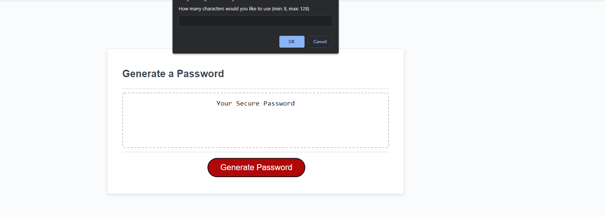

A password generator that creates a random random password based on criteria chosen from prompts.

Options:

 
 * Number of Characters Between 8 & 12
 * Special Characters to Include
    1. lowercase
    2. UPPERCASE
    3. Special Characters
    4. Numbers

Invalid inputs will inform the user and continue to ask the user for valid input until either one is given or the prompt is canceled.

https://deejerz88.github.io/Challenge-3/

    
  
